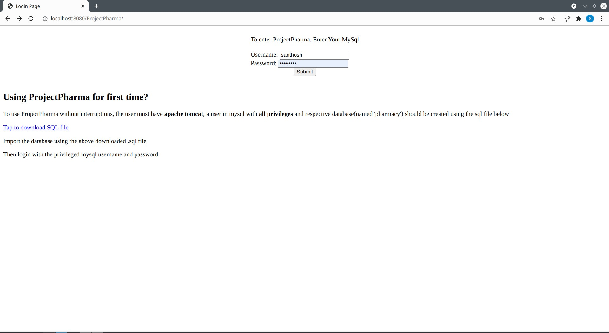
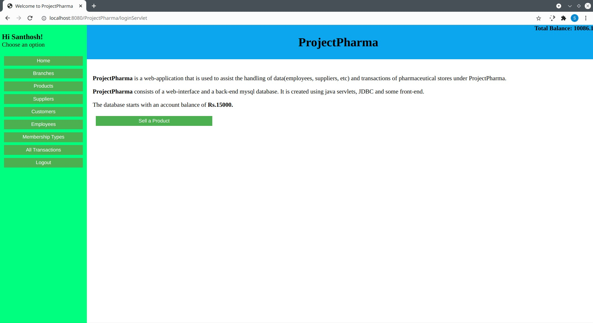
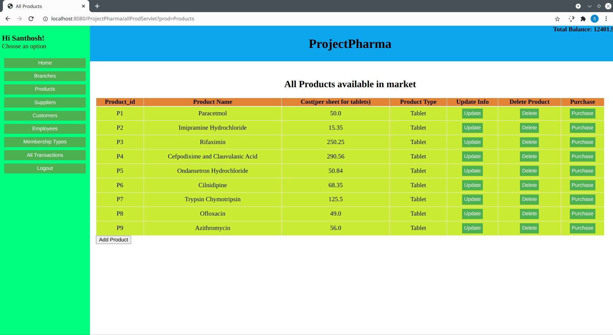
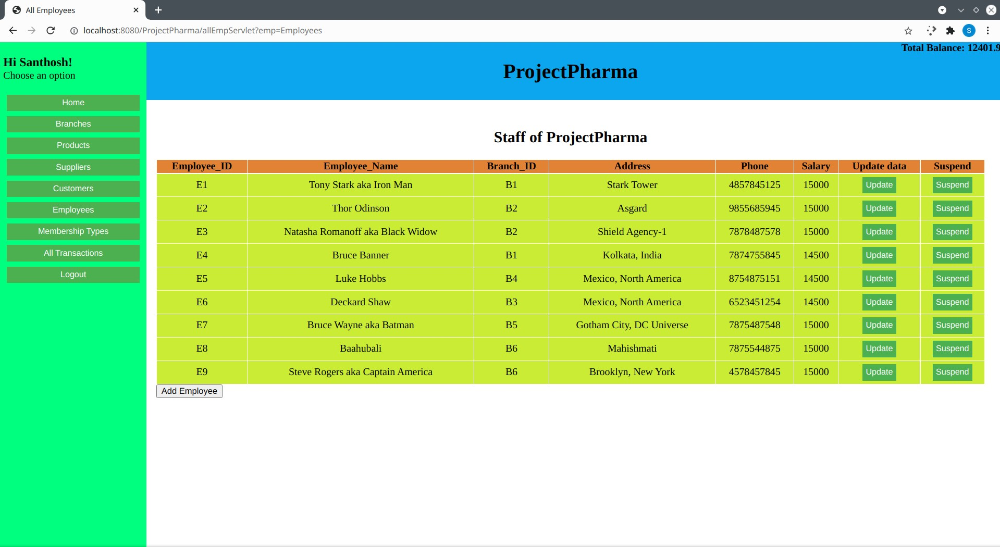
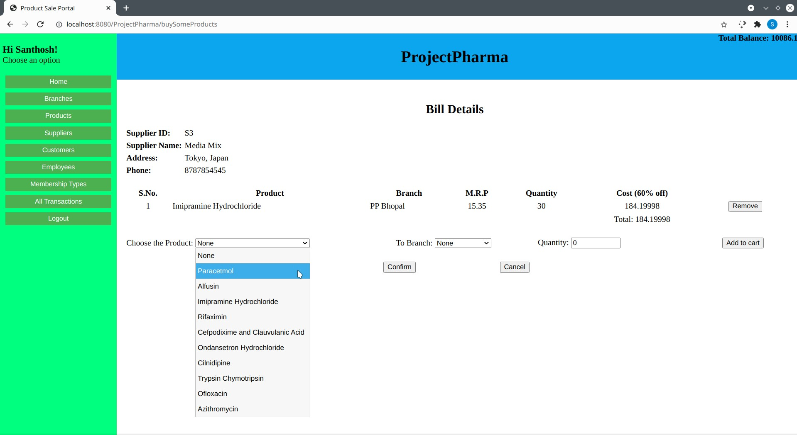

# ProjectPharma
ProjectPharma is a web-application that is used to assist the handling of data(employees, suppliers, etc) and transactions of pharmaceutical stores under ProjectPharma.

ProjectPharma consists of a web-interface and a back-end mysql database. It is created using java servlets, JDBC and some front-end. Size of this project around 2300 lines of code.

## How to use ProjectPharma?
To use above ProjectPharma.war file, the system should have
#### 1. apache tomcat
#### 2. mysql user with all privileges
#### 3. mysql database named 'pharmacy'

On first deployment of ProjectPharma, the user should download the .sql file as instructed and import database using the file.

## Screenshots

